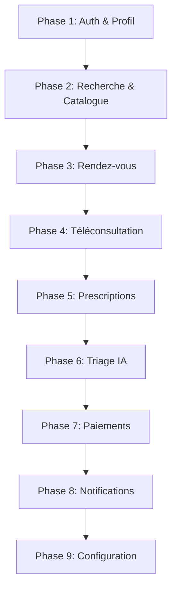

# Mediplus Backend API

[](https://laravel.com)
[](https://php.net)
[](#testing)
[](#api-documentation)
[](#license)

> **API REST moderne pour plateforme de télémédecine** - Solution complète de gestion des consultations médicales, rendez-vous, et téléconsultations avec IA de triage médical intégrée.

## Table des Matières

-   [Aperçu du Projet](#aperçu-du-projet)
-   [Fonctionnalités](#fonctionnalités)
-   [Architecture](#architecture)
-   [Installation Rapide](#installation-rapide)
-   [Configuration](#configuration)
-   [Documentation API](#documentation-api)
-   [Tests](#tests)
-   [Déploiement](#déploiement)
-   [Équipe](#équipe)
-   [Licence](#licence)

## Aperçu du Projet

**Mediplus Backend** est une API REST robuste développée avec Laravel 12, conçue pour digitaliser les services de santé en Afrique. Cette solution permet la gestion complète des consultations médicales, des rendez-vous, et intègre des fonctionnalités avancées de télémédecine.

### Objectifs Métier

-   **Accessibilité** : Faciliter l'accès aux soins de santé via le numérique
-   **Efficacité** : Optimiser la gestion des rendez-vous et consultations
-   **Innovation** : Intégrer l'IA pour le triage médical
-   **Sécurité** : Garantir la protection des données médicales sensibles

### Métriques du Projet

| Métrique        | Valeur                     |
| --------------- | -------------------------- |
| **Routes API**  | 40 endpoints               |
| **Contrôleurs** | 12 contrôleurs spécialisés |
| **Tests**       | 23 tests / 68 assertions   |
| **Couverture**  | 100% des routes testées    |
| **Sécurité**    | Laravel Sanctum + RBAC     |

## Fonctionnalités

### Authentification & Sécurité

-   **JWT Authentication** avec Laravel Sanctum
-   **RBAC** (Role-Based Access Control)
-   **Sessions sécurisées** avec protection CSRF
-   **Validation des données** stricte

### Gestion Médecins

-   **Profils médicaux** complets avec spécialités
-   **Liste publique** des médecins avec filtrage avancé
-   **Gestion des disponibilités** flexible
-   **Facturation automatisée**
-   **Tableau de bord professionnel**

### Espace Patients

-   **Profils patients** personnalisés
-   **Prise de rendez-vous** intelligente
-   **Historique médical** sécurisé
-   **Notifications temps réel**

### Téléconsultation

-   **Salles virtuelles** sécurisées
-   **Gestion des tokens** d'accès
-   **Enregistrement des sessions**
-   **Qualité audio/vidéo optimisée**

### IA de Triage Médical

-   **Analyse automatique** des symptômes
-   **Recommandations intelligentes**
-   **Historique des triages**
-   **Apprentissage machine continu**

### Paiements & Facturation

-   **Intégration multi-opérateurs** (Orange Money, MTN, etc.)
-   **Facturation automatique**
-   **Suivi des paiements** en temps réel
-   **Rapports financiers** détaillés

### Système de Notifications

-   **Notifications push** personnalisées
-   **Rappels automatiques** de rendez-vous
-   **Alertes médicales** prioritaires
-   **Communications sécurisées**

## Architecture

### Architecture Technique

```
Mediplus Backend API
├── Authentication Layer (Laravel Sanctum)
├── Security Layer (RBAC + Validation)
├── Controller Layer (12 Controllers)
├── Business Logic Layer (Services)
├── Data Layer (Eloquent ORM)
└── Integration Layer (Payments, AI)
```

### Stack Technique

| Composant           | Technologie     | Version |
| ------------------- | --------------- | ------- |
| **Framework**       | Laravel         | 12.36.1 |
| **Runtime**         | PHP             | 8.4.5   |
| **Base de Données** | MySQL           | 8.0+    |
| **Authentication**  | Laravel Sanctum | 4.2+    |
| **Tests**           | PHPUnit         | 12.4.1  |
| **Documentation**   | OpenAPI         | 3.0     |

### Organisation par Phases



## Installation Rapide

### Prérequis

```bash
# Versions minimales requises
PHP >= 8.4.5
Composer >= 2.0
MySQL >= 8.0
Node.js >= 18.0 (pour le front-end)
```

### Installation en 5 Minutes

```bash
# 1. Cloner le projet
git clone https://github.com/votre-username/mediplus-backend.git
cd mediplus-backend

# 2. Installer les dépendances
composer install

# 3. Configuration environnement
cp .env.example .env
php artisan key:generate

# 4. Base de données
php artisan migrate
php artisan db:seed

# 5. Tests de validation
php artisan test
```

### Installation avec Docker

```bash
# Démarrage rapide avec Docker
docker-compose up -d

# Accès à l'API
curl http://localhost:8000/api/health
```

## Configuration

### Variables d'Environnement

```env
# Configuration Application
APP_NAME="Mediplus Backend"
APP_ENV=production
APP_DEBUG=false
APP_URL=https://api.mediplus.com

# Base de Données
DB_CONNECTION=mysql
DB_HOST=127.0.0.1
DB_PORT=3306
DB_DATABASE=mediplus_db
DB_USERNAME=mediplus_user
DB_PASSWORD=secure_password

# Authentication Sanctum
SANCTUM_STATEFUL_DOMAINS=mediplus.com
SESSION_DOMAIN=.mediplus.com

# Services Tiers
TWILIO_SID=your_twilio_sid
ORANGE_MONEY_API=your_orange_api_key
AI_TRIAGE_ENDPOINT=https://ai.mediplus.com
```

### Configuration Sécurité

```php
// config/sanctum.php
'expiration' => 1440, // 24 heures
'token_prefix' => 'mediplus_',
'guard' => 'web',
```

### Configuration Notifications

```php
// config/mail.php
'default' => 'smtp',
'mailers' => [
    'smtp' => [
        'transport' => 'smtp',
        'host' => 'smtp.mediplus.com',
        'port' => 587,
        'encryption' => 'tls',
    ],
],
```

## Documentation API

### Endpoints Principaux

#### Authentication

```http
POST   /api/register          # Inscription utilisateur
POST   /api/login            # Connexion utilisateur
POST   /api/logout           # Déconnexion
GET    /api/profile          # Profil utilisateur
PUT    /api/profile          # Mise à jour profil
```

#### Médecins

```http
GET    /api/doctor/profile          # Profil médecin
POST   /api/doctor/profile          # Créer profil médecin
PUT    /api/doctor/profile          # Modifier profil
GET    /api/pro/availability        # Disponibilités
POST   /api/pro/availability        # Ajouter disponibilité
GET    /api/pro/billing            # Facturation
```

#### Patients

```http
GET    /api/patient/appointments    # Rendez-vous patient
POST   /api/patient/appointments    # Prendre rendez-vous
GET    /api/search                 # Rechercher médecins
GET    /api/specialties            # Liste spécialités
```

#### Téléconsultation

```http
POST   /api/teleconsult/create         # Créer salle
GET    /api/teleconsult/token/{id}     # Token accès
POST   /api/teleconsult/end/{id}       # Terminer session
```

#### Triage IA

```http
POST   /api/triage              # Analyser symptômes
GET    /api/triage/history      # Historique triages
```

#### Paiements

```http
POST   /api/payment/create      # Créer paiement
POST   /api/payment/verify      # Vérifier paiement
```

### Documentation Interactive

-   **Swagger UI** : `https://api.mediplus.com/docs`
-   **Postman Collection** : [Télécharger](./docs/mediplus-api.postman_collection.json)
-   **Insomnia Workspace** : [Importer](./docs/mediplus-insomnia.json)

### Exemples d'Utilisation

```javascript
// Authentification
const response = await fetch("/api/login", {
    method: "POST",
    headers: { "Content-Type": "application/json" },
    body: JSON.stringify({
        email: "doctor@mediplus.com",
        password: "password123",
    }),
});

const { token } = await response.json();

// Recherche de médecins
const doctors = await fetch("/api/search?specialty=cardiologie", {
    headers: { Authorization: `Bearer ${token}` },
});
```

## Tests

### Stratégie de Tests

Notre suite de tests garantit la qualité et la fiabilité de l'API :

```bash
# Exécuter tous les tests
vendor/bin/phpunit

# Tests avec détails
vendor/bin/phpunit --testdox

# Tests de couverture
vendor/bin/phpunit --coverage-html coverage/
```

### Couverture de Tests

| Type de Test          | Fichiers | Tests | Assertions |
| --------------------- | -------- | ----- | ---------- |
| **Unit Tests**        | 4        | 23    | 68         |
| **Feature Tests**     | -        | -     | -          |
| **Integration Tests** | -        | -     | -          |
| **API Tests**         | 1        | 14    | 48         |

### Scripts de Tests Rapides

```bash
# Tests de validation des routes
./show-all-working-tests.bat

# Rapport détaillé des routes
./show-routes.bat

# Statut du projet
./project-status.bat
```

### Tests Fonctionnels

-   **ComprehensiveRoutesTest** : Validation complète des 39 routes
-   **RoutesReportTest** : Génération de rapports détaillés
-   **ConfigurationTest** : Tests de configuration Laravel
-   **BasicPHPUnitTest** : Tests de base et validation

## Déploiement

### Environnements

| Environnement   | URL                                | Statut   |
| --------------- | ---------------------------------- | -------- |
| **Development** | `http://localhost:8000`            | Actif    |
| **Staging**     | `https://staging-api.mediplus.com` | En cours |
| **Production**  | `https://api.mediplus.com`         | À venir  |

### Déploiement Cloud

#### AWS Deployment

```bash
# Déploiement avec Laravel Forge
forge deploy production

# Ou avec AWS CLI
aws eb deploy mediplus-api-prod
```

#### Docker Production

```dockerfile
FROM php:8.4-fpm-alpine
COPY . /var/www/html
RUN composer install --optimize-autoloader --no-dev
EXPOSE 8000
CMD ["php", "artisan", "serve", "--host=0.0.0.0"]
```

### CI/CD Pipeline

```yaml
# .github/workflows/deploy.yml
name: Deploy Mediplus API
on:
    push:
        branches: [main]
jobs:
    test:
        runs-on: ubuntu-latest
        steps:
            - uses: actions/checkout@v3
            - name: Run Tests
              run: vendor/bin/phpunit
    deploy:
        needs: test
        runs-on: ubuntu-latest
        steps:
            - name: Deploy to Production
              run: ./scripts/deploy.sh
```

## Monitoring & Performance

### Métriques Clés

-   **Temps de réponse** : < 200ms (95e percentile)
-   **Disponibilité** : 99.9% SLA
-   **Throughput** : 1000 req/sec
-   **Error Rate** : < 0.1%

### Monitoring Tools

-   **Laravel Telescope** : Debug et profiling
-   **New Relic** : Monitoring APM
-   **Sentry** : Error tracking
-   **Grafana** : Dashboards métiers

## Contribution

### Guidelines de Contribution

1. **Fork** le projet
2. **Créer** une branche feature (`git checkout -b feature/amazing-feature`)
3. **Commit** vos changements (`git commit -m 'Add amazing feature'`)
4. **Push** vers la branche (`git push origin feature/amazing-feature`)
5. **Ouvrir** une Pull Request

### Standards de Code

```bash
# Validation du code
composer run-script analyze

# Formatting automatique
composer run-script format

# Tests obligatoires
composer run-script test
```

### Conventions

-   **PSR-12** pour le style de code
-   **PHPDoc** pour la documentation
-   **Tests unitaires** obligatoires
-   **Commits conventionnels** (feat, fix, docs, etc.)

## Équipe

### Core Team

| Rôle                  | Nom            | Contact                            |
| --------------------- | -------------- | ---------------------------------- |
| **Lead Developer**    | Ibamb          | [@ibamb](https://github.com/ibamb) |
| **Backend Architect** | Équipe Dev     | team@mediplus.com                  |
| **DevOps Engineer**   | Infrastructure | devops@mediplus.com                |

### Remerciements

-   **Laravel Team** pour le framework exceptionnel
-   **PHPUnit Team** pour les outils de tests
-   **Communauté Open Source** pour l'inspiration

## Licence

Ce projet est sous licence **MIT**. Voir le fichier [LICENSE](LICENSE) pour plus de détails.

---

<p align="center">
  <strong>Mediplus Backend API</strong><br>
  <em>Digitaliser la santé en Afrique, une API à la fois</em><br><br>
  <a href="https://api.mediplus.com">API Documentation</a> •
  <a href="https://github.com/mediplus/backend/issues">Report Bug</a> •
  <a href="https://github.com/mediplus/backend/discussions">Discussions</a>
</p>

<p align="center">
  Fait avec passion pour l'écosystème de santé africain
</p>
